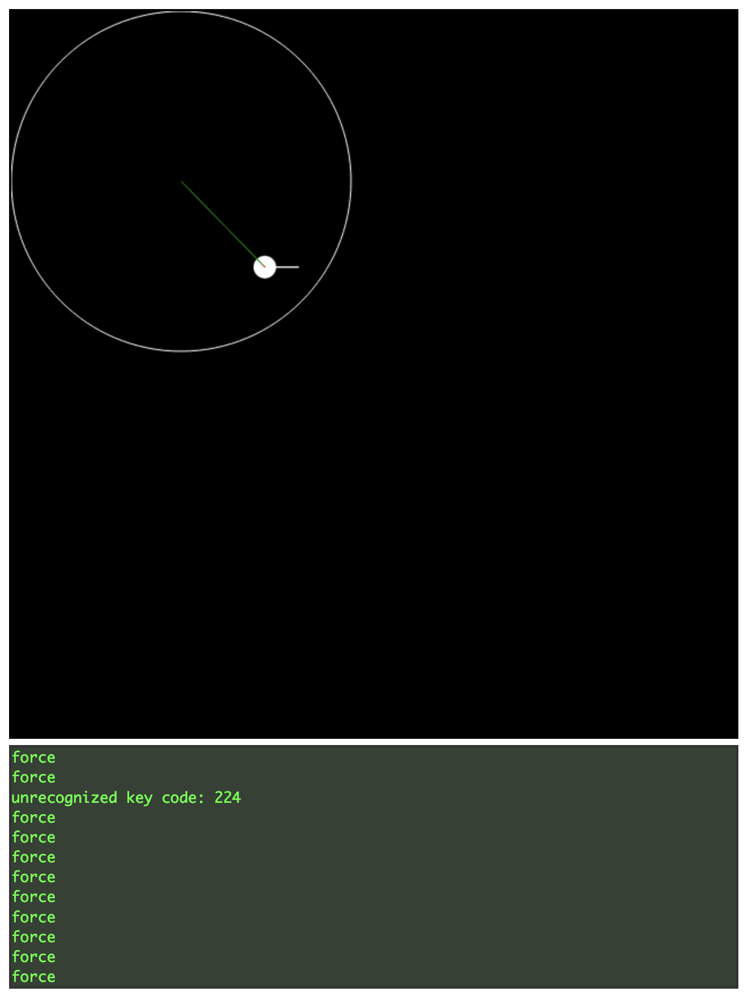

Step 2
============

I did repurpose the structure of the `html,css,js` in this example and built a 2D 
view. There is a ball, and a force field that attracts objects when they are 
in the specified radius. The user can manipulate the ball and push it around up,down,left,right.

Open [index.html](./index.html) in your browser.

