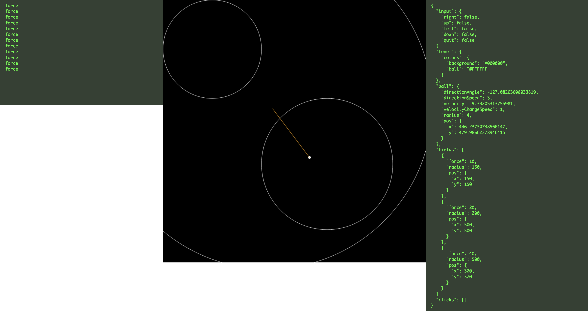

Step 3
============

I've changed the ball state to include the direction, velocity in this example. Also, the force
fields are gradually weakening when you are further away from their centre. 
Ball controls are more natural as well.

Added a click handler to begin working on creating temporary force fields.

Fixed some issues in the logic for ball direction computation.

Open [index.html](./index.html) in your browser.

